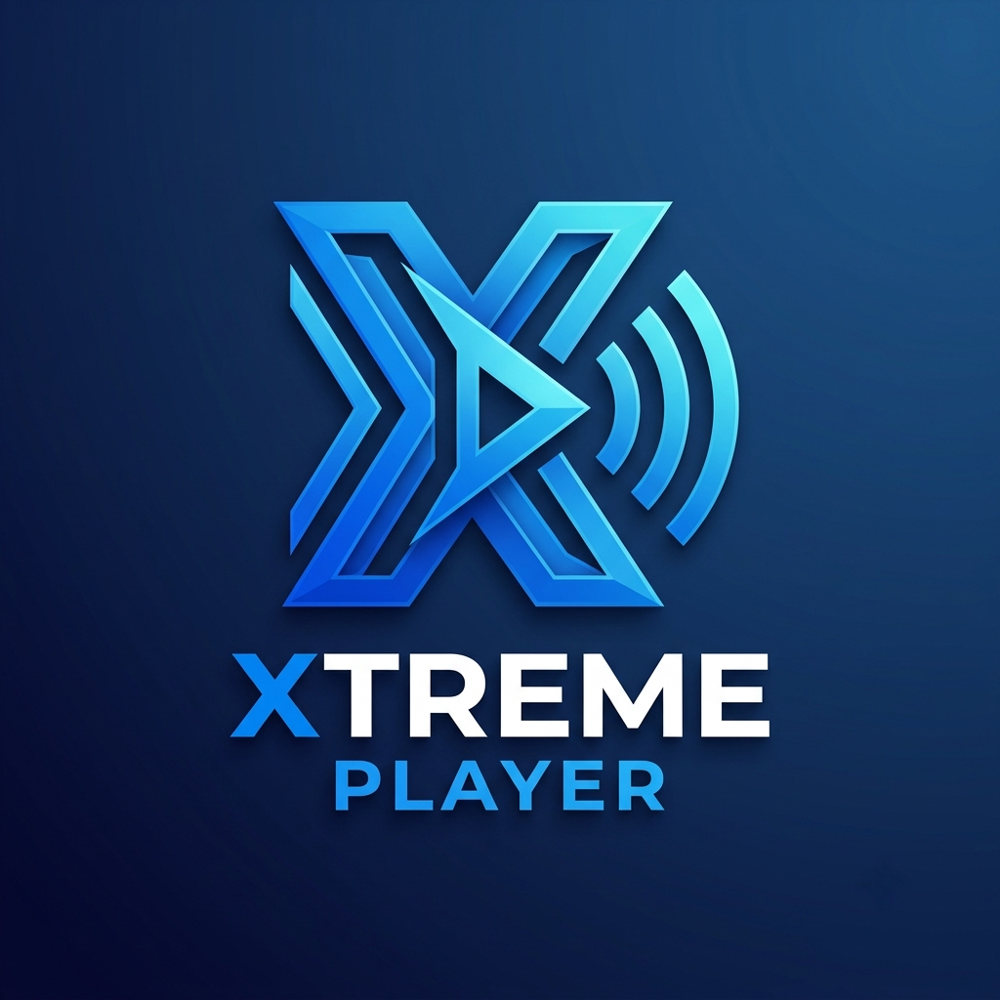
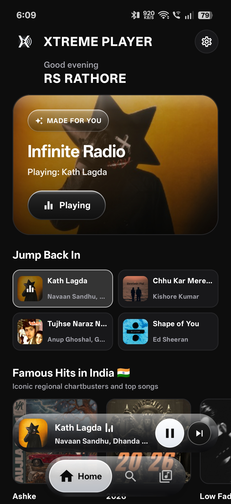
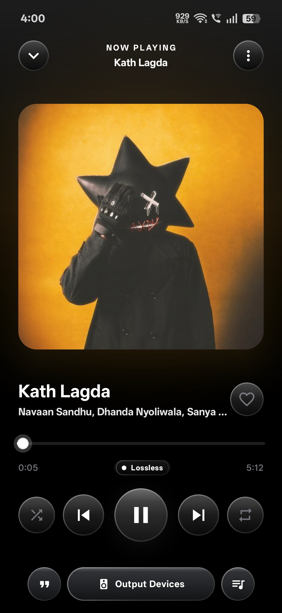
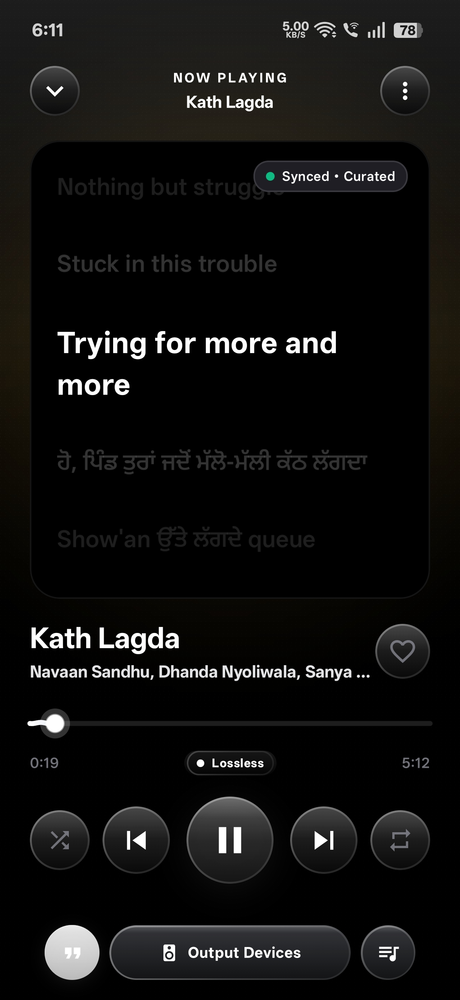
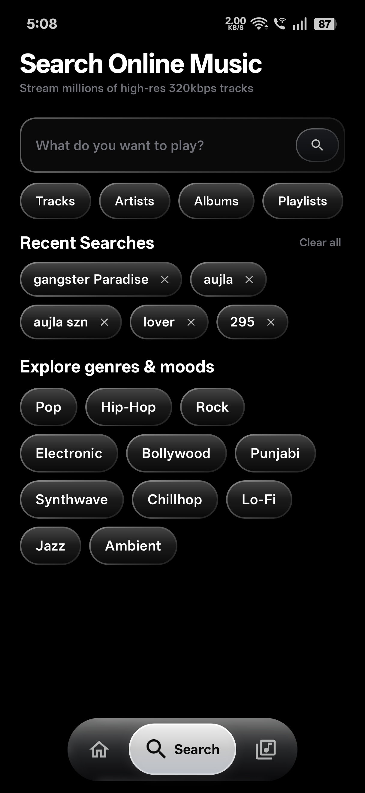
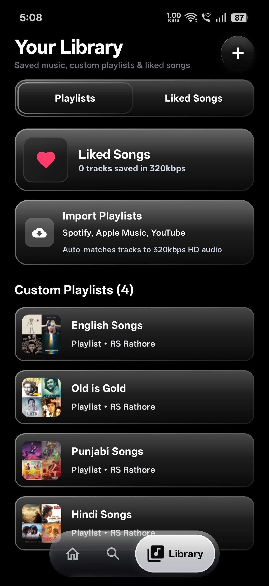
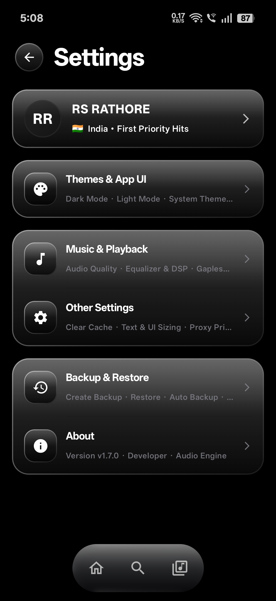
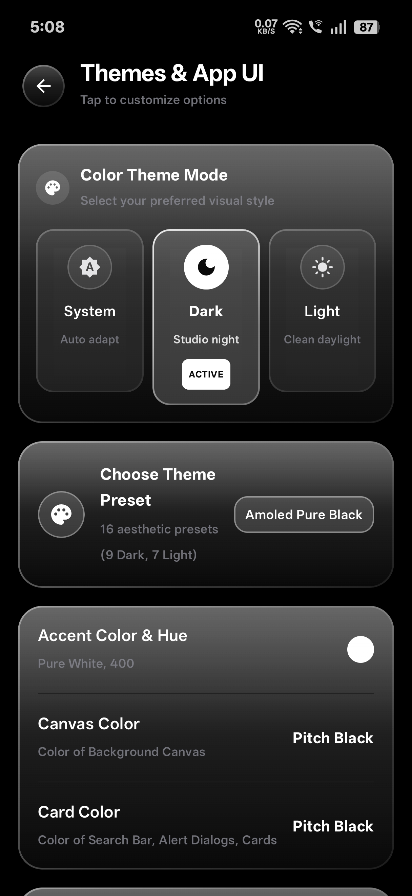
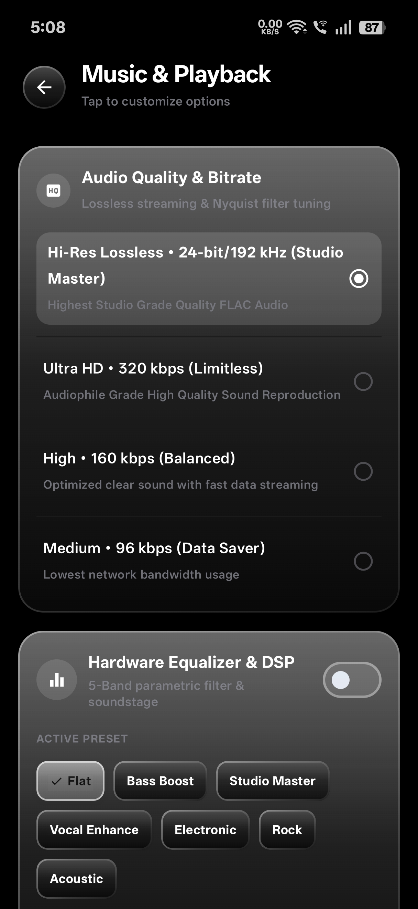

  <!-- Centered Circular App Logo -->
  

  <!-- Project Title -->
  <h1> Xtreme Player</h1>

  <!-- Short Overview -->
  

    <b>Xtreme Player</b> is a lightweight, modern, open-source online music streaming application for Android. Built with a clean Material You (Material 3) interface and Liquid glass design, it delivers an ad-free, high-fidelity audio experience with zero subscription paywalls.
  

  

    Stream millions of online tracks in studio-grade <b>High-Res Audio</b>, manage custom libraries, and enjoy seamless playback without interruptions.
  

  <!-- Badges -->
  

    
    
    
  

  <!-- Quick Navigation -->
  

    <a href="#-app-interface">App Interface</a> •
    <a href="#-key-features">Key Features</a> •
    <a href="#-built-with">Built With</a> •
    <a href="#-getting-started">Getting Started</a>
  

---

## 📸 App Interface

  <table>
    <tr>
      <td align="center" width="25%">
         
        <b>Home View</b>
      </td>
      <td align="center" width="25%">
         
        <b>Now Playing</b>
      </td>
      <td align="center" width="25%">
         
        <b>Synced Lyrics</b>
      </td>
      <td align="center" width="25%">
         
        <b>Music Search</b>
      </td>
    </tr>
    <tr>
      <td align="center" width="25%">
         
        <b>Your Library</b>
      </td>
      <td align="center" width="25%">
         
        <b>Settings Hub</b>
      </td>
      <td align="center" width="25%">
         
        <b>Themes & UI</b>
      </td>
      <td align="center" width="25%">
         
        <b>Audio & DSP</b>
      </td>
    </tr>
  </table>

---

## ✨ Key Features

### 🎧 High-Fidelity Audio Streaming
- **True 320 kbps HQ Audio:** Stream crystal-clear, high-bitrate music (MP3, AAC, FLAC) with minimal compression.
- **Smart Caching & Zero Buffering:** Intelligent pre-caching ensures uninterrupted playback even on unstable connections.
- **Background Playback & Media Controls:** Persistent Android 13+ lock screen and notification controls powered by AndroidX Media3.
- **Music & Playlists:** Import playlists from Spotify, Apple Music, Amazon Music, or custom local files.
- **Better Recommendations:** Cleaner regional song recommendations without repetitive country tags.
- **Fresh Genre Playlists:** Fixed shuffle logic to load new, randomized songs every time you open a genre.

### 🎨 Clean & Modern Material UI
- **Material 3 Design:** Sleek, minimalistic aesthetic with dynamic AMOLED dark mode or Material light mode and fluid animations.
- **Modern Full-Screen Player:** Ambient artwork glow, dynamic color palette matching, real-time waveform scrubbing, and tactile haptic controls.
- **Persistent Mini-Player:** Floating mini-player with swipe-to-skip gestures and seamless bottom-sheet expansion.
- **Visuals & Customization:**
  - **10 Curated Themes:** Added 5 Dark and 5 Light presets with full color palette controls.
  - **Granular Color Picker:** Customize Accent, Canvas, and Card colors with live swatches and weight options.
  - **Custom Gradients:** Fine-tune Background, Card, and Bottom Sheet gradients with new visual presets.
  - **Text & UI Scaling:** Flexible 7-level scaling options for both typography and full interface density.

### 🔍 Discovery & Music Management
- **Instant Online Search:** Fast, debounced search engine for tracks, artists, top hits, and albums.
- **Personalized Library:** Save favorites, organize custom playlists, and view listening history.
- **Queue & Playlists:** Drag-and-drop track reordering, shuffle modes, and smart loop controls.

### 🔓 100% Free & Open Source
- **No Ads, No Paywalls:** Pure music streaming without sponsored interruptions.
- **Privacy-First:** No invasive tracking, profiling, or unnecessary background permissions.
- **Community-Driven:** Fully open-source codebase open for contributions and audits.

---

## 🛠 Built With

- **Language:** Kotlin
- **UI Toolkit:** Jetpack Compose & Material Design 3
- **Audio Engine:** AndroidX Media3 (ExoPlayer + MediaSessionService)
- **Architecture:** Clean Architecture + MVI / MVVM
- **Database:** Room (Local playlists and metadata caching)
- **Image Loading:** Coil Compose
- **Networking:** Retrofit2 & OkHttp3

---

## 🚀 Getting Started

### Prerequisites
- Android Studio Ladybug (2024.2.1 or newer)
- Android SDK 26+ (Android 8.0 Oreo or higher)
- JDK 17+

